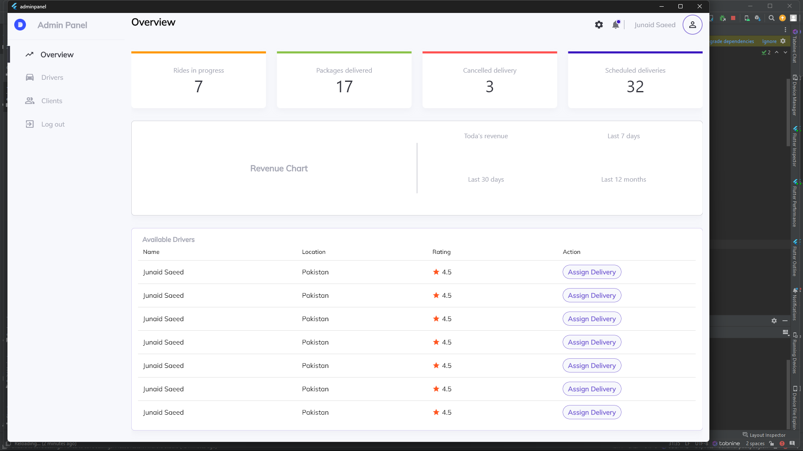
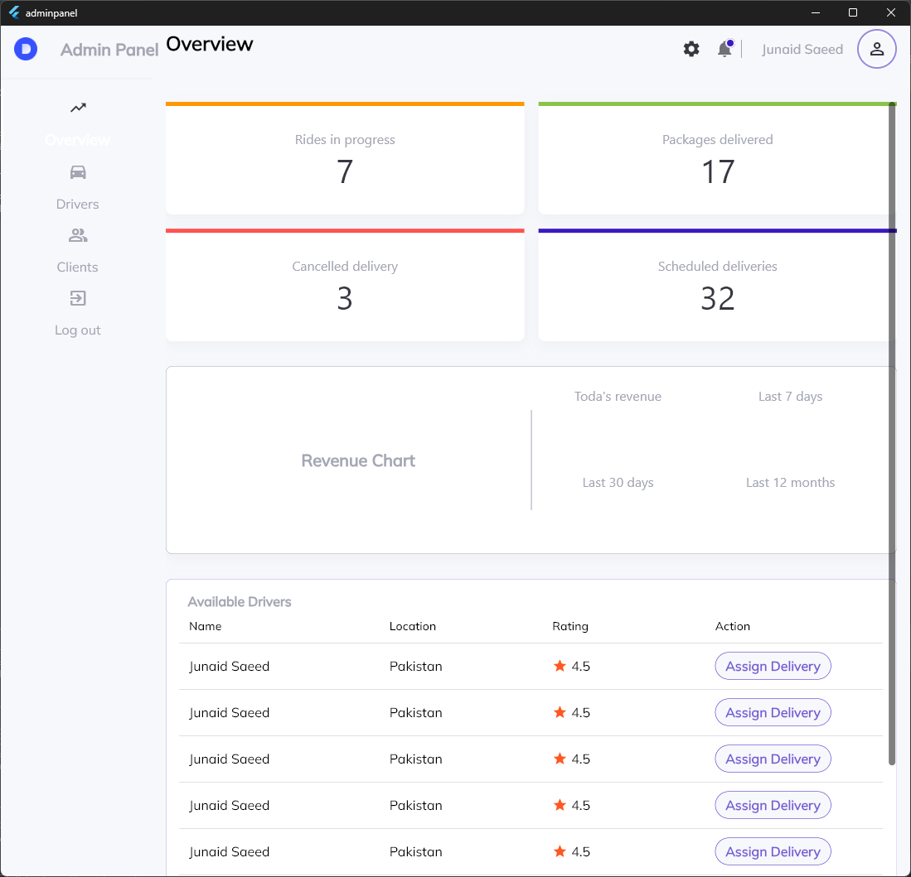
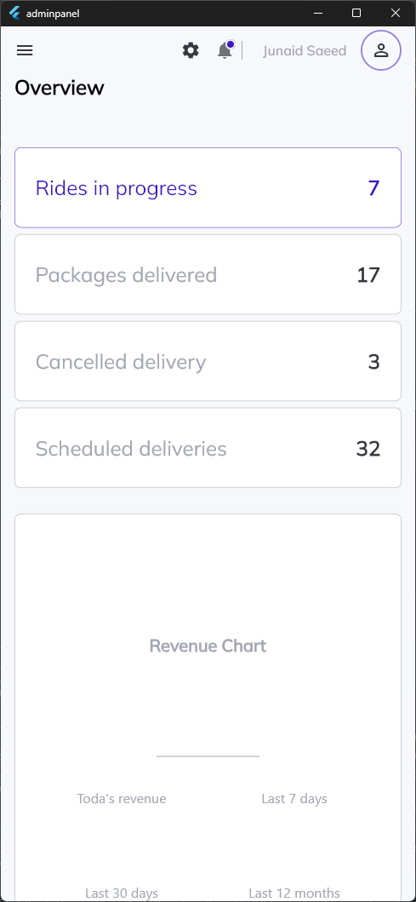

# A Responsive Admin Panel with flutter with routing

## On Desktop

## On Tablet

## On Mobile Devices

## Authors Information
My name is Junaid Saeed, I am a Computer Engineer with skilled in flutter, NodeJs ,ExpressJS, MongoDB, MySQL , DevOPS, for more information please check the links bellow.

- [LinkedIn: Junaidsaeed](https://www.linkedin.com/in/junaid-saeed-7479951a4/)
- Skype: Junaid Saeed

For help getting started with Flutter, view our
[online documentation](https://flutter.io/docs), which offers tutorials,
samples, guidance on mobile development, and a full API reference.